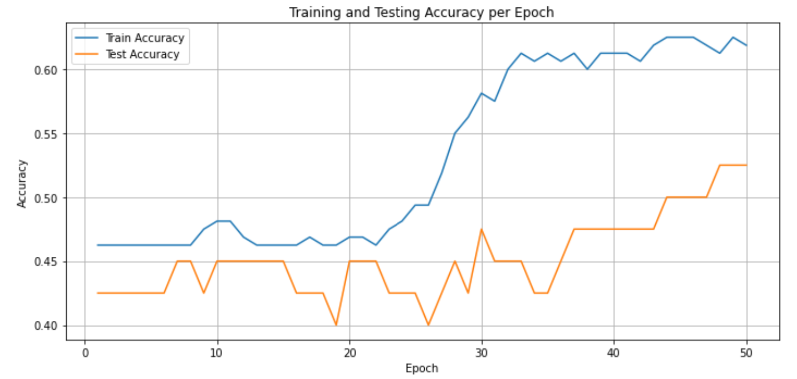

# Seizure Prediction API (with Docker and Cloud Deployment)

This project demonstrates a simple machine learning pipeline for seizure prediction using EEG-like synthetic features. It includes training, saving, serving the model via an API using Flask, containerizing it with Docker, and deploying it on the cloud using [Render](https://render.com).

---

## 🧠 Model Overview

The model is a `MLPClassifier` (Multi-layer Perceptron) trained on the following synthetic EEG features:
- `mean_bandpower`
- `spike_count`
- `frequency_variation`

The model is trained and saved as `seizure_model.pkl` using `joblib`.

### 📈 Accuracy Plot (Training vs Testing)


---

## ⚙️ Project Structure

```
├── seizure_model.pkl            # Trained ML model
├── serve_model.py               # Flask API to serve the model
├── Dockerfile                   # Docker instructions for containerization
├── requirements.txt             # Python dependencies
├── Seizure_Prediction_MLOPs_API.ipynb # Jupyter notebook for training and analysis
├── accuracy_plot.png            # Accuracy comparison of training vs testing
└── README.md                    # This file
```

---

## ▶️ How to Run Locally

1. **Install dependencies**
```bash
pip install -r requirements.txt
```

2. **Run Flask API**
```bash
python serve_model.py
```
Access: `http://127.0.0.1:5000/predict`

3. **Test the API**
```bash
curl -X POST http://127.0.0.1:5000/predict -H "Content-Type: application/json" -d "{"mean_bandpower": 6.5, "spike_count": 3, "frequency_variation": 1.2}"
```

---

## 🐳 Docker Instructions

1. **Build Docker image**
```bash
docker build -t seizure-api .
```

2. **Run the container**
```bash
docker run -p 5000:5000 seizure-api
```

---

## ☁️ Deployment (Render)

1. Push your project to GitHub
2. Go to [Render Dashboard](https://dashboard.render.com/)
3. Create new Web Service:
    - Environment: `Docker`
    - Repository: `seizure-api-docker`
4. Ensure `serve_model.py` ends with:
```python
app.run(debug=True, host="0.0.0.0", port=5000)
```

5. After deployment, test your cloud endpoint:
```bash
curl -X POST https://your-api-url.onrender.com/predict -H "Content-Type: application/json" -d "{"mean_bandpower": 6.5, "spike_count": 3, "frequency_variation": 1.2}"
```

---

## 🙌 Credits

Built with ❤️ by [Shiva Maleki] for demonstrating MLOps and deployment in healthcare applications.